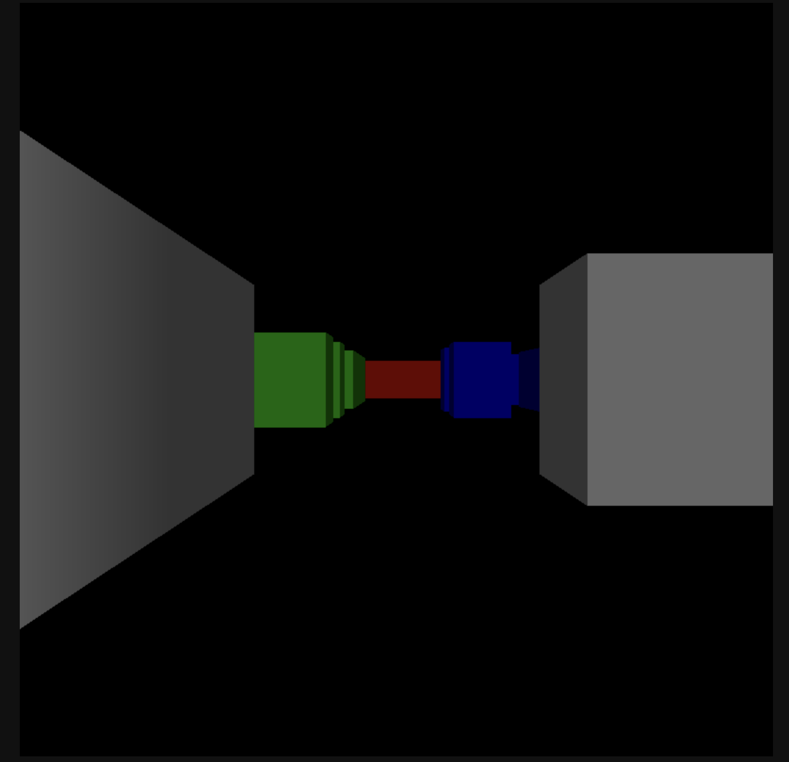

# Javascript-Raycasting
Raycasting in javascript, like the one in Wolfenstein 3D.
You can move and look around using WASD.

Latest image:

Resources used to build this:
1. [Lodev raycasting tutorial](https://lodev.org/cgtutor/raycasting.html)
2. [Austin Henley tutorial](https://austinhenley.com/blog/raycasting.html)

I used (1.) for the general implementation and (2.) whenever I did not understand (1.) and also for inspiration (it is pretty cool how it moves and implements the dithering)

To implement:
- Add textures
- Add ceiling and floor
